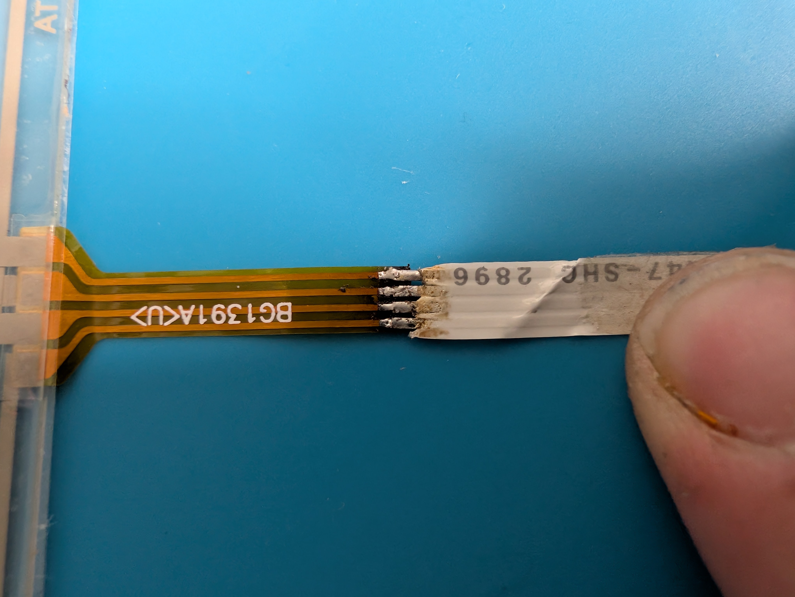
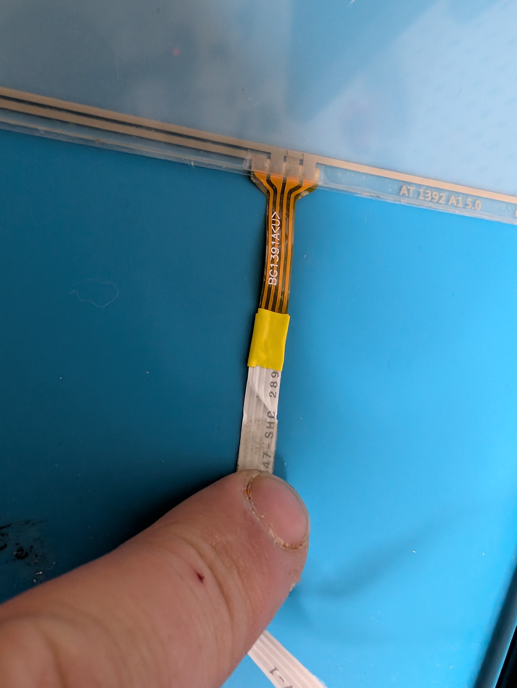
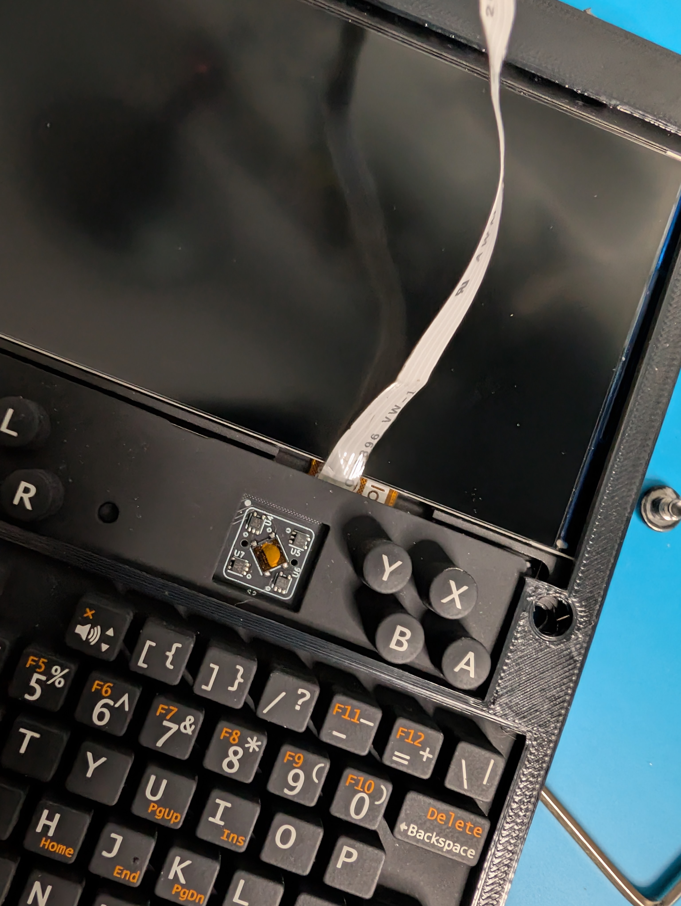
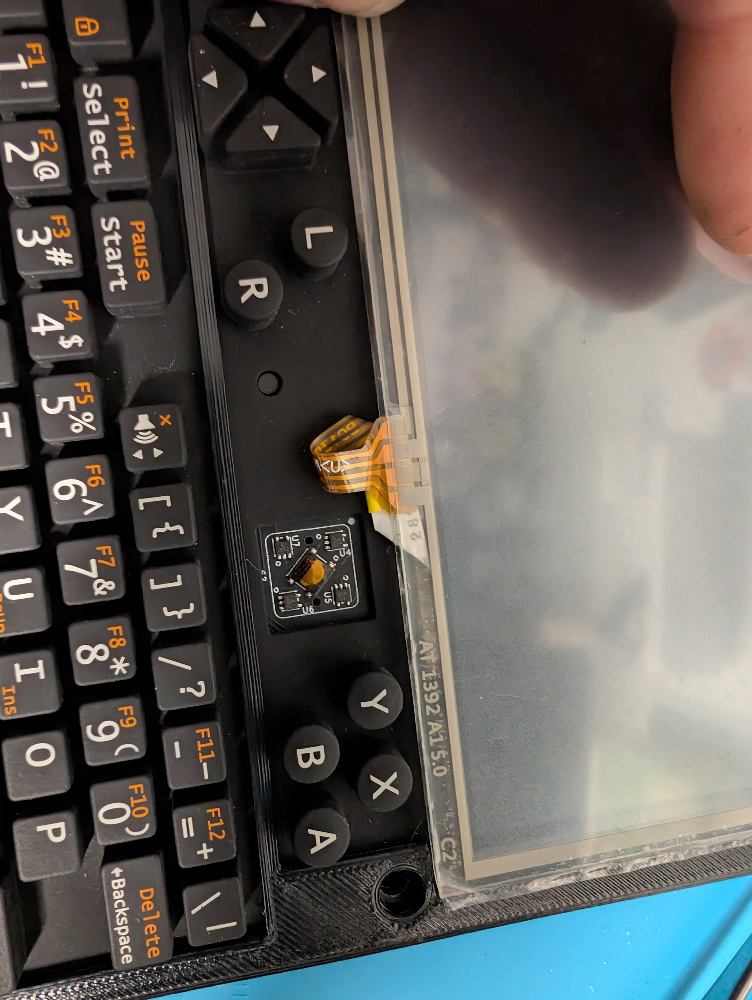
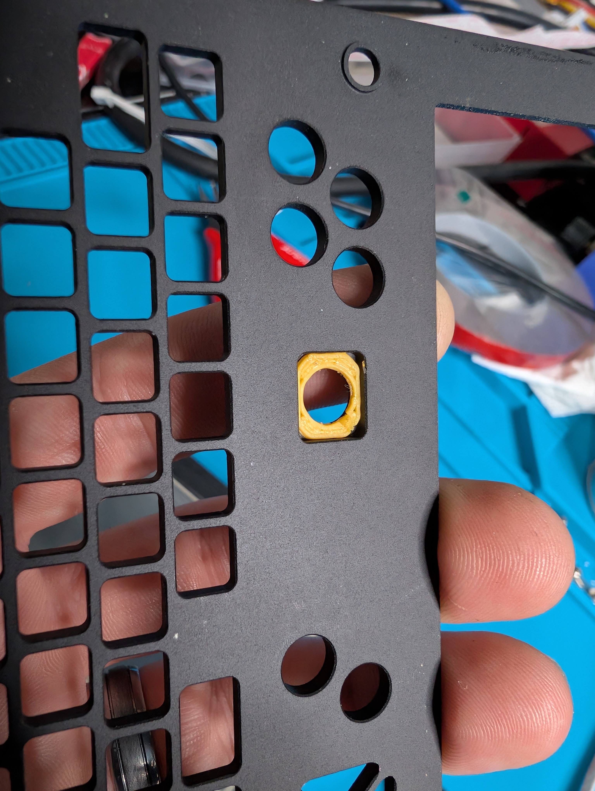
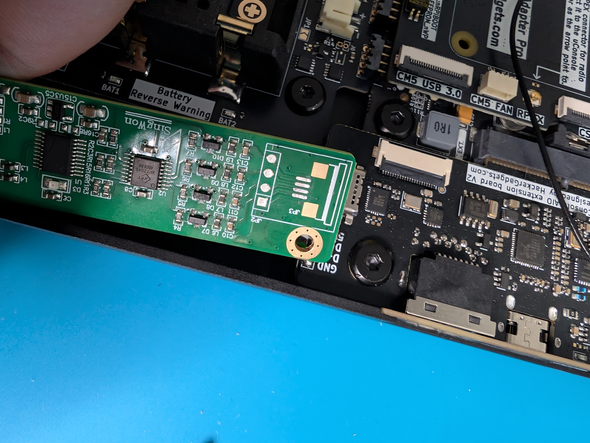
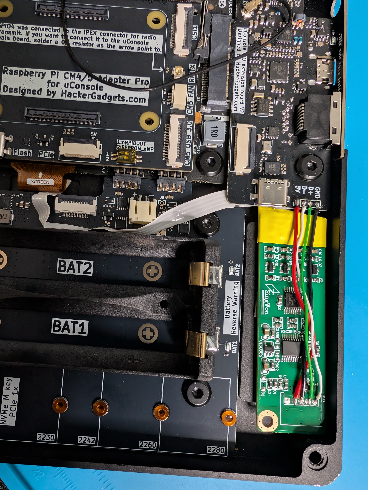
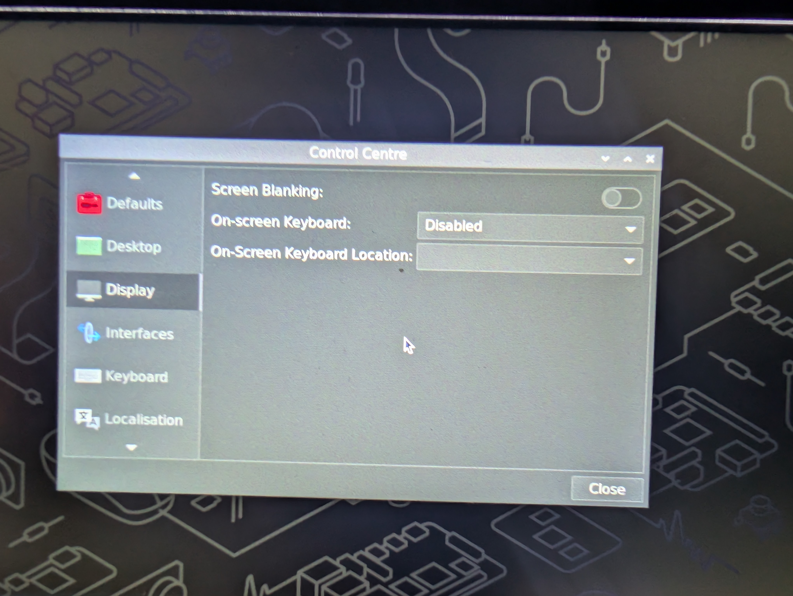
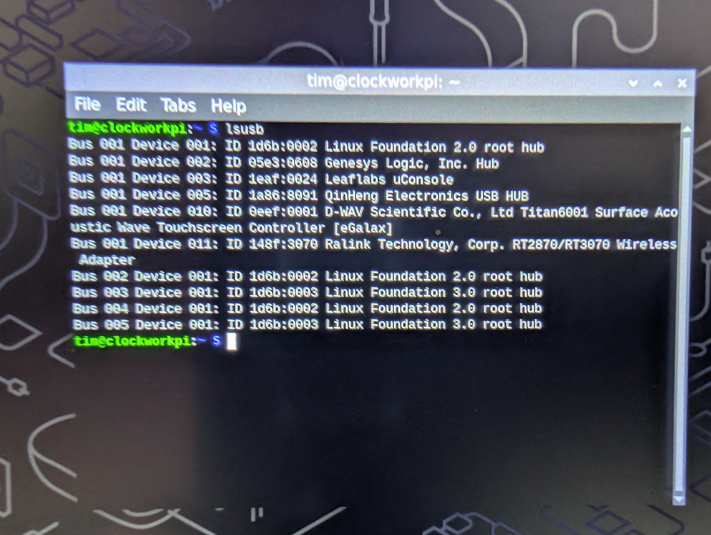
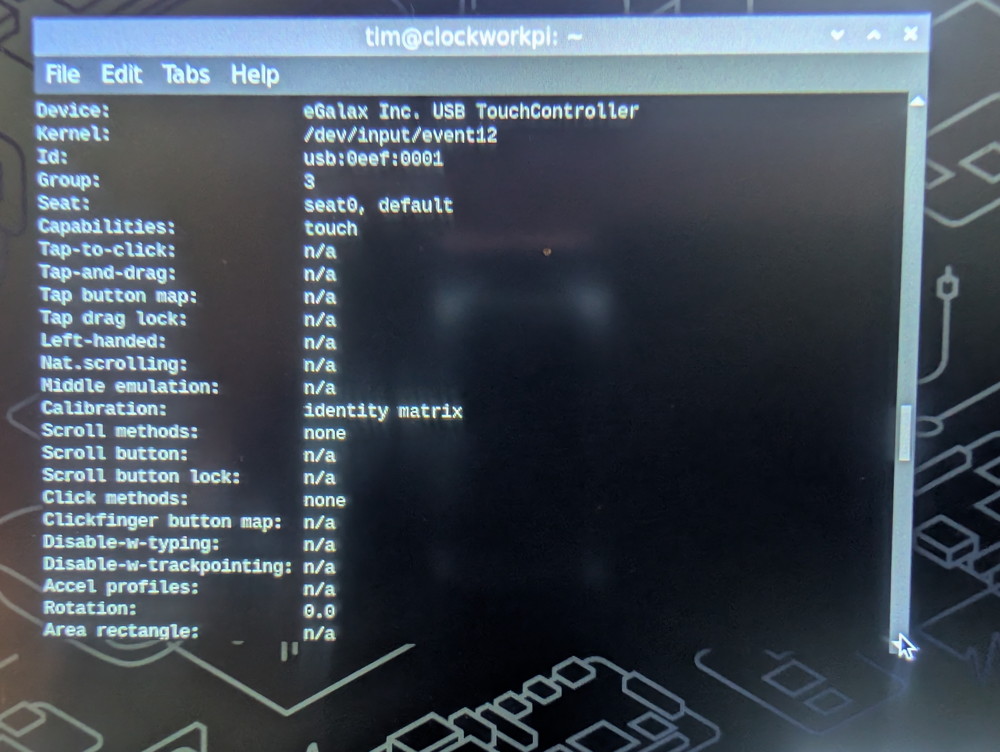

# uConsole Touchscreen Modification Guide

A step-by-step guide to installing a 4.3-inch resistive touchscreen mod onto the ClockworkPI uConsole using an AIOv2 expansion board.


**UPDATE: Latest system upgrades break the original udev rules. updates are below on how to fix this using labwc**
---

## 🛠️ The Hardware

### Parts Required
* **4.3-inch Resistive Touch Panel:** 4-wire configuration (102 x 62mm). Available on [AliExpress](https://a.aliexpress.com/_mMjZnBX).
* **Resistive Touch Controller:** Available on [AliExpress](https://a.aliexpress.com/_mK2ssTT).
* **Bolts:** 6 x 8mm M4 button head bolts.
* **Wiring:** Wires to solder the USB touch controller to the uConsole expansion board.
* **Extension:** Ribbon cable for extending the touch panel ribbon.

### 3D Printed Parts
* `Trackball_Spacer.stl`
* `Screen_spacer.stl`

---

## 🔧 Hardware Installation

### 1. Extending the Ribbon Cable
The ribbon cable on the touch panel is too short and requires extending. Use a scrap piece of ribbon cable and solder it directly to the connector part.



Ensure you mark this ribbon cable carefully to preserve the correct polarity when connecting the controller later.


Apply a piece of Kapton tape (or alternative insulating tape) over the solder joints to protect against short circuits or bending damage.



### 2. Feeding the Cable
This cable needs to feed in through the same housing hole as the LCD ribbon. You will need to make a sharp right-angle fold for it to fit properly.




### 3. Case Assembly
Place the 3D printed `Trackball_Spacer.stl` into the original front faceplate.



Install the 3D printed surround onto the main frame before placing the trackball and the front face into position. Secure the assembly using the M4 bolts. 

> 💡 *Tip: If your bolts are slightly too long, you can 3D print additional washers to take up the slack.*

---

## ⚡ Wiring and Controller Fitment

Turn over the uConsole to begin working on the internal wiring.

1. **Prep the Board:** If your controller board includes pre-installed plugs on the touch input or USB output, remove them using flush cutters or a desoldering iron.
2. **Test Fit:** Check the controller board placement. Positioning it right under the expansion board works well, but may require trimming a tiny bit off the edge of the controller card. As long as you do not cut into any active circuit tracks, the board will be fine.
   
   

3. **Soldering:** 
   * Solder the extended touch ribbon directly to the controller board.
   * Solder the 4 USB data/power wires to the controller board.
4. **Final Tuck:** Carefully fold the ribbon cable layers so they tuck cleanly inside the case boundaries.



---

## 💻 Software Configuration

This configuration was validated using the recommended Debian and Ubuntu environments outlined in the [AIOv2 Setup Guide](https://hackergadgets.com).

### 1. Disable the On-Screen Keyboard
To prevent interference, disable the default OS virtual keyboard:
1. Navigate to **Pi Menu** ➔ **Preferences** ➔ **Control Centre**.
2. Under **Display Options**, change **On-screen Keyboard** to **Disabled**.



### 2. Enable USB Power via Terminal
Open your terminal application. If you are utilizing the AIOv2 board, power up the touch controller hardware rail:

```bash
# Power on the USB rail immediately
aiov2_ctl usb on

# Enable the USB rail permanently at system boot
aiov2_ctl --boot-rail usb on
```

Verify that the USB controller is recognized by the operating system:
```bash
lsusb
```



### 3. Persistent 90° Calibration Rule
Locate your touchscreen device driver string to verify its system designation:
```bash
sudo libinput list-devices
```



Copy your hardware name (e.g., `"eGalax Inc. USB TouchController"`). Create a persistent Udev rules file to map the touch coordinates correctly for the rotated landscape panel:

```bash
sudo nano /etc/udev/rules.d/99-touchscreen-calibration.rules
```

Add the following configuration string strictly on **one single line**:

```text
ATTRS{name}=="eGalax Inc. USB TouchController", ENV{LIBINPUT_CALIBRATION_MATRIX}="0.0 1.246571 -0.085628 -1.048012 0.0 1.018752"
```

Save and exit the file (`Ctrl+X`, then `Y`, then `Enter`).

### 4. Apply Changes
Reboot your uConsole to initialize the persistent calibration matrix:
```bash
sudo reboot
```
**UPDATE:**
If the above did not work or fails to work after doing a `sudo apt update && sudo apt upgrade -y` commands then you need to update the rc.xml file instead.

```bash
sudo nano ~/.config/labwc/rc.xml
```
Look through the file and delete any lines with `touch` at the start. `Ctrl+k` deletes whole lines in nano.

At the end of the file just before `</openbox_config>` insert the following lines

```text
  <libinput>
    <device category="eGalax Inc. USB TouchController (USB 1-1.4.3)">
      <calibrationMatrix>0.0 1.246571 -0.085628 -1.048012 0.0 1.018752</calibrationMatrix>
    </device>
  </libinput>
```

Save and exit the file (`Ctrl+X`, then `Y`, then `Enter`).

Reboot your uConsole to initialize the persistent calibration matrix:
```bash
sudo reboot
```

### 5. Test and Enjoy!
Test your tracking across the panel. Note that this resistive screen configuration responds best when using a precise stylus!
